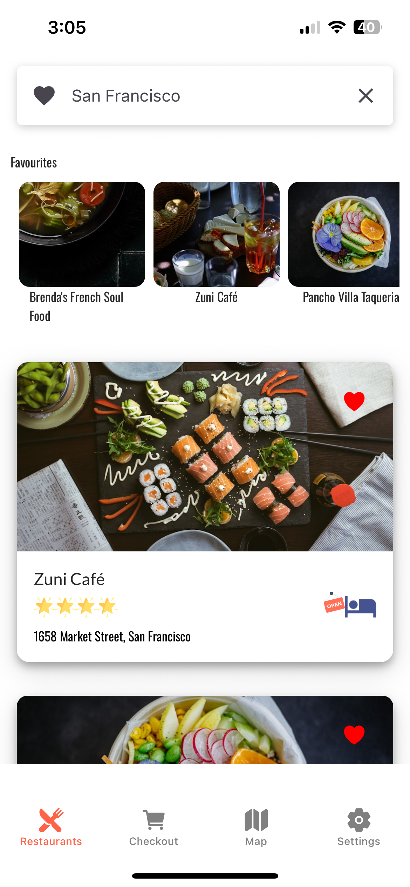
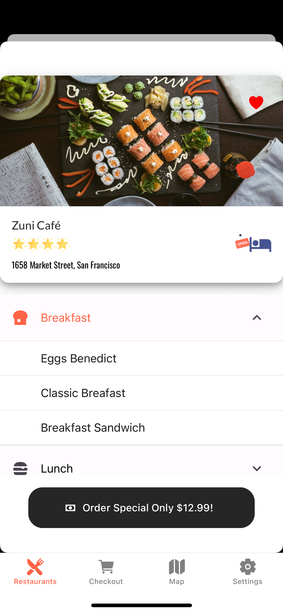
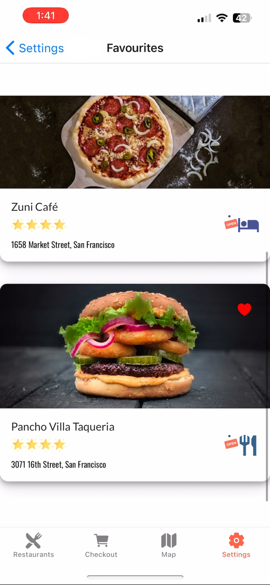
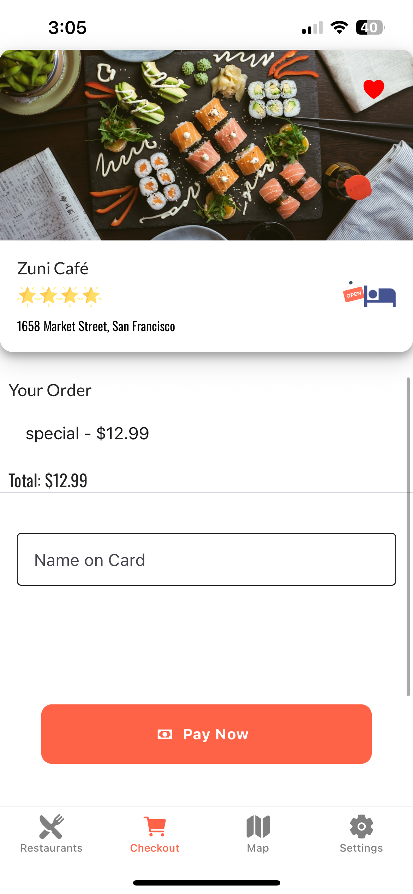

<p align="center">
  
</p>

# Meals-To-Go 🍔📱

Cross-platform **React Native (Expo)** mobile app that lets users browse restaurants, view details, save favourites, and check out sample items with a mock payments flow. Built as part of my **Zero To Mastery** React Native development certification and extended with modern tooling, clean UI, and real device features (camera avatar, persistent favourites, etc.).

> **Tech Stack:** Expo SDK 54 • React Native 0.81 • Yarn • React Navigation • React Native Paper • Styled-Components • Firebase (Auth/Functions) • AsyncStorage

---

## ✨ Features

- **Restaurant list + search** (mock Google Places data)
- **Restaurant details** with ratings & open/closed indicator
- **Favourites**: heart/save restaurants (persisted via AsyncStorage)
- **Checkout flow** with mock payment API (Cloud Functions)
- **User auth scaffolding** (Firebase-ready; swap in your keys and rules)
- **Settings screen** with **camera avatar** (Expo Camera + Media Library)
- **Map screen** (component scaffolded; ready to wire up with Map provider)
- **Performant image loading** (works with reliable sources like Unsplash)

---

## 📸 Screenshots

| Home | List | Details |
|------|------|---------|
|  |  |  |

| Favourites | Checkout | Settings |
|------------|---------|----------|
|  |  |  |

| Camera Avatar |
|---------------|
|  |

---

## 🧑‍🎓 Developer

**Autumn Fawcett**  
📍 Canada  
💼   
🎓 Certified React Native Developer —  

> This app was built and extended as part of my **Zero To Mastery React Native Development Certification**, demonstrating mastery of:
> - Cross-platform mobile app development using React Native and Expo  
> - Firebase Authentication and Functions integration  
> - State management via Context API  
> - Component-based architecture and reusable design systems  
> - Real-device features (Camera, AsyncStorage, Maps)

📜 **Certificate:**  


---

## 🚀 Quick Start

```bash
# 1) install deps
yarn

# 2) start the dev server (Metro)
yarn start

# 3) run on simulator
#   - press "i" for iOS
#   - press "a" for Android
